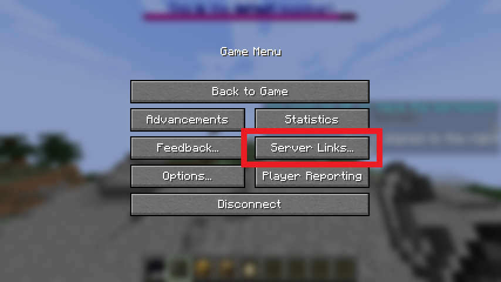
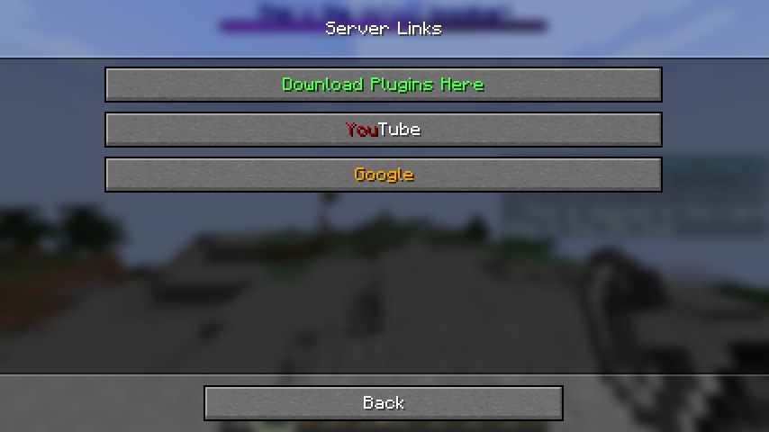

# BetterLinks

BetterLinks adds support for the new server links feature in 1.21+. This adds a new button to the game menu, which when
pressed will bring you to a new menu with buttons showing customizable text heading to customizable URLs.

This project and its collaborators use the following regularly and are thankful for their maintenance:
- [PacketEvents](https://github.com/retrooper/packetevents)
- [sharkbyte-configuration](https://github.com/amnoah/sharkbyte-configuration)

## Photos

## Requirements

This plugin only supports 1.21+ on platforms with an existing BetterLinks implementation. This includes Spigot,
Paper (and its forks), Folia, Sponge, and (soon) Fabric.

## Quick Feature Breakdown
- Platform independent design.
- Fully packet-based.
- Color code support.
- Weight-based, allowing for sorting.

For individual platform features, please check each module.

# Documentation

Please check the [BetterLinks wiki](https://github.com/amnoah/BetterLinks/wiki).

Necessary documentation will either be included in the config file or in the wiki.

# Support

For general support, please join my [Discord server](https://discord.gg/ey9uTg3hcy).

For issues with the project, please open an issue in the issues tab.